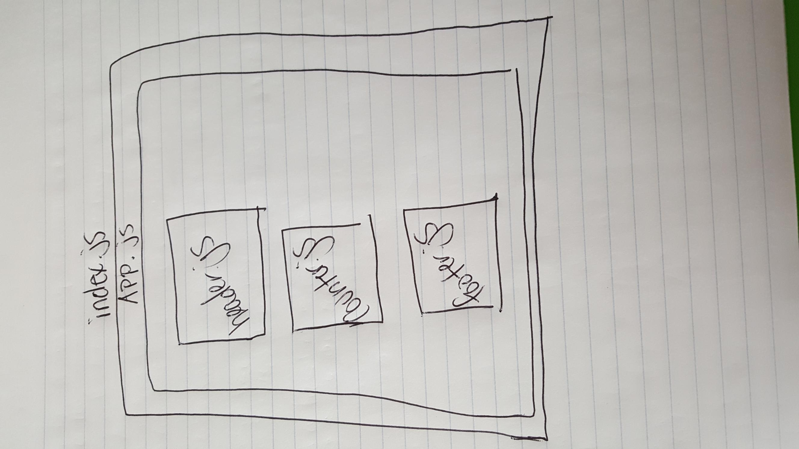

## LAB: Testing & Deployment

### Author: Siobhan Niess

### Links and Resources
- [code sandbox site](https://923w80q99o.codesandbox.io/)
- [code sandbox repo](https://codesandbox.io/s/923w80q99o)
- [github repo](https://github.com/niesssiobhan/lab27)
- [AWS bucket hosted site](http://lab27niess.s3-website-us-east-1.amazonaws.com/)

### Modules
#### `modulename.js`
##### Exported Values and Methods

- `/build/` this holds the build files
- `public/index.html` this holds the React boilerplate
- `src/app.js` this holds the public core app functionality
- `src/base.scss` this holds the styling for the app
- `src/components/footer/footer.js` this holds the footer
- `src/components/header/header.js` this holds the header
- `src/components/counter/counter.js` this holds the counter
- `src/index.js` this renders the app
- `src/reset.scss` this holds the css reset
- `src/setupTests.js` this holds the React testing boilerplate
- `src/__tests__/src/components/counter.test.js` this holds the tests

#### UML
